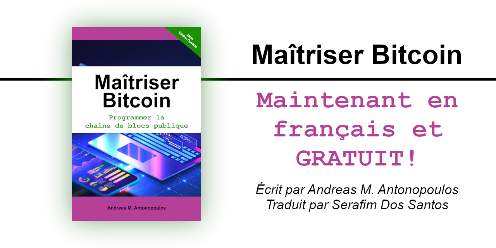
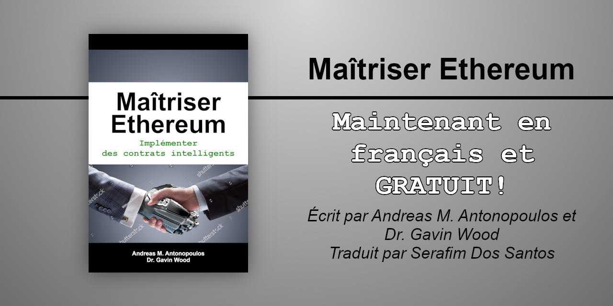

# Maîtriser.ça! Apprendre sur les technologies Web 3.0

## Maîtriser Bitcoin : Programmer la cha&icirc;ne de blocs publique, 2ième édition ouverte

  

Le livre **Maîtriser Bitcoin : Programmer la chaîne de blocs publique** (_**Mastering Bitcoin: Programming the Open Blockchain**_ par O'Reilly Media) tel qu'écrit originalement en anglais par _Andreas M. Antonopoulos_, traduit en français (Canada) par _Google Translate API_ et révisé par _Serafim Dos Santos_ avec les termes du [Grand dictionnaire terminologique (GDT)](https://gdt.oqlf.gouv.qc.ca/) de l'[Office qu&eacute;b&eacute;cois de la langue fran&ccedil;aise](https://www.oqlf.gouv.qc.ca/).

### 👉 <a href="https://bitcoin.maitriser.ca">bitcoin.maitriser.ca</a> 👈

---
  
## Maîtriser Ethereum : Implémenter des contrats numériques, 1ère édition ouverte

  

Le livre **Maîtriser Ethereum : Implémenter des contrats numériques** (_**Mastering Ethereum: Implementing digital contracts**_ par O'Reilly Media) tel qu'écrit originalement en anglais par _Andreas M. Antonopoulos_ et _Dr. Gavin Wood_, traduit en français (Canada) par _Google Translate API_ et révisé par _Serafim Dos Santos_ avec les termes du [Grand dictionnaire terminologique (GDT)](https://gdt.oqlf.gouv.qc.ca/) de l'[Office qu&eacute;b&eacute;cois de la langue fran&ccedil;aise](https://www.oqlf.gouv.qc.ca/).

### 👉 <a href="https://ethereum.maitriser.ca">ethereum.maitriser.ca</a> 👈
